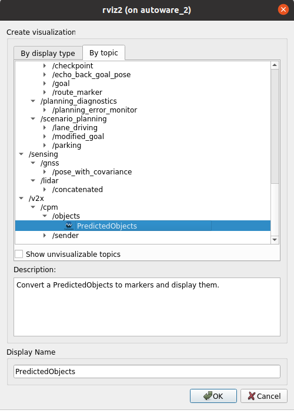

# CAM message publikálása L2-ben 

## Előkészítés 

-    hasznalt docker image: `ghcr.io/autowarefoundation/autoware:universe-devel-cuda-humble`
-    docker network készítése (a dokcer eth0jara csatlakoznak a message ek amiket wireshark al el ehet kapni a host rol )   
    `docker network create --driver=bridge --subnet=10.0.0.0/24 v2x_net -o com.docker.network.bridge.name="v2x_net"`

## Contianer futtatása: 

A scripts folderbe talalhato a `run_cont.sh` shell file aminek sehitsegevel el lehet inditani a container t 
### FONTOS a shell file ba at irni az elereseket a vanetza source is kell az asn messsage dekodolasok miatt (nem tudom h nincs benne a python package be XD)

## Container-ben 

### Autoware launch a szokásos

1. A dokcerbe a szokasos helyen van az autoware install:
- `source /opt/autoware/setup.bash`

2. Ezután jöhet a planning-simulator launch:
- `ros2 launch autoware_launch  planning_simulator.launch.xml map_path:=$HOME/maps/highway`

NOTES: itt ha esetleg launch error az memory allocation miatt emelni kell a host on a memry size t (claude segít)

## CAM telepítése `colcon` -al

1. uj shell egy adott continer-be:  
`docker exec -it autoware_x bash`

2. Az ASN py modul feltelepítése:  
`pip install asn1tools`!!!!!!!!!!!!!!!!(Ezt aakkor be kéne tenni a saját docker image be h tegye fel default)!!!!!!!!!!!!!!!!!!!!!!

3. Autoware se source olasa (az rclpy es a többi message type miatt):  
`source /opt/autoware/setup.bash`
4. autowarev2x package build elése és telepitése  
`cd dev`  
`colcon build --symlink-install --cmake-args -DCMAKE_BUILD_TYPE=Release`
## CAM modul indítása:  

`ros2 launch autoware_v2x cam.launch.py`

NOTES: ezen commit alatt van a merged node ami egsyerre kuldi es fogajda a CAM message eket 

## Vizualizácó RVIZ ben: 

Ahogy lent is látható modon hozzá kell adni az rvizhez az adott topic ot csak nekünk most `cam` lesz nem `cpm` 

## Ellenőrzés wireshark segítségével: 

Futtatás : `sudo wireshark`

Ezután a programon belül a host gép `v2x_net` interface ét kell keresni azon beül lesz található az adatforgalom 